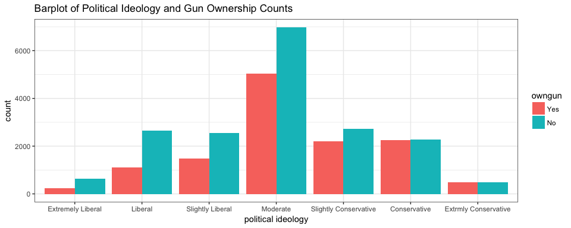
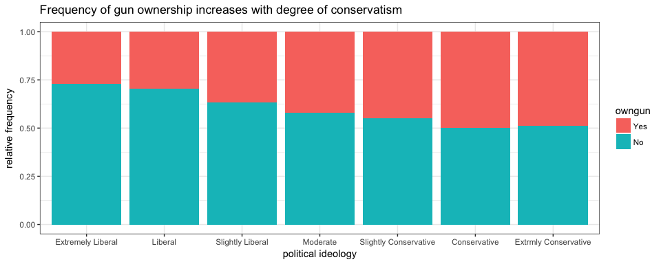

# Statistical inference with the GSS data
Dale Richardson  
`r format(Sys.Date(), "%B %d, %Y")`  

## Setup

### Load packages


```r
library(ggplot2)
```

```
## Warning: package 'ggplot2' was built under R version 3.3.2
```

```r
library(dplyr)
library(statsr)
```

### Load data

The `gss.Rdata` file is provided in my git-hub repository. 


```r
load("gss.Rdata")
```


* * *

## Part 1: Data

Observations in the GSS sample were collected using a form of random sampling (either `block quota sampling` in the years 1972-1974 and for half of the 1975-1976 surveys or `full probability` sampling for half of the 1975-1976 surveys and up to 2014.) Complete details of the sampling procedures are provided in Appendix A of the [documentation section of the GSS website](http://gss.norc.org/Get-Documentation).  

To put things more simply: "Each survey from 1972 to 2004 was an independently drawn sample of English-speaking persons 18 years of age or over, living in non-institutional arrangements within the United States. Starting in 2006 Spanish-speakers were added to the target population."

Therefore, the target population of the survey is English and Spanish speakers 18 years or older, residing in the United States in non-institutional arrangments, e.g. military installations, religious institutions, prison, etc. Since the observations were obtained using a random sampling approach, we can generalize our findings based on this sample to the entire United States adult population who speak English or Spanish.

Data were collected by in-person interviews either with paper questionnaires or starting in 2002, the GSS was conducted by using computer-assisted personal interviewing. Respondents to the GSS were randomly selected, but there was no random assignment of respondents to particular groups, meaning: this is an observational study, **NOT** an experiment, thus it is not possible to infer causality. 


* * *

## Part 2: Research question

For this short project, my research question is a simple one and considers the cumuluative responses across all years of the survey:

**Does gun ownership vary according to political ideology or is gun ownership independent of political ideology?**

This question is interesting to me because I am simply curious to see how gun ownership might vary according to political view. I assume that liberals would own less guns than conservatives, but I am fully aware that there are probably many other factors at play in determining whether someone owns a gun or not. Does the person live in a rural area or the city? Is an extremely conservative less likely to own a gun in the city, whereas an extremely liberal person more likely to own a gun if living in a rural area? I think I am interested in my proposed research question because it is a good springboard for further exploration into other demographic factors and variables that influence whether or not someone owns a gun.


* * *

## Part 3: Exploratory data analysis

Here, I will illustrate the steps I've taken to extract the necessary variables for exploratory analyses. I will focus on the political views variable, `polviews` and the gun-ownership variable, `owngun`. 

Recall that I am including responses across all years of the GSS, which means I have included responses from 1972-2012. 


```r
#  select variables of interest and remove NAs
poli.guns.plot <- gss %>% select(polviews, owngun) %>% na.omit() %>% filter(owngun != "Refused") %>% group_by(polviews, owngun) 

# Remove "Refused" level for proper chi2 df calculation
poli.guns.plot$owngun <- factor(poli.guns.plot$owngun)

# can use the table function in base R to tally results into a contigency table
poli.guns.tab <- table(poli.guns.plot)

# print the table
poli.guns.tab
```

```
##                        owngun
## polviews                 Yes   No
##   Extremely Liberal      231  624
##   Liberal               1110 2660
##   Slightly Liberal      1474 2554
##   Moderate              5050 6977
##   Slightly Conservative 2211 2714
##   Conservative          2260 2282
##   Extrmly Conservative   476  498
```

```r
# plot
ggplot(poli.guns.plot, aes(polviews, ..count..)) +
        geom_bar(aes(fill = owngun), position = "dodge") +
        ggtitle("Barplot of Political Ideology and Gun Ownership Counts") +
        xlab("political ideology") +
        theme_bw()
```

<!-- -->

According to the above plot, we can immediately see that the ratio of gun owners to non-gun owners approaches 1 as one moves up the categories from "extremely liberal" to "extremely conservative". Another interesting facet of this data is that there are many more survey respondents that identify themselves are moderates. I would venture to say that the majority of Americans are probably moderates in their political views, while the extreme liberals and conservatives are well, relegated to the tail ends of a normal distribution (**NOT** depicted above!)

I am curious to see how the above plot would look if we turned it into a relative frequency bar plot. 


```r
# plot rel freq
ggplot(poli.guns.plot, aes(polviews)) +
        geom_bar(aes(fill = owngun), position = "fill") +
        ggtitle("Frequency of gun ownership increases with degree of conservatism") +
        ylab("relative frequency") +
        xlab("political ideology") +
        theme_bw()
```

<!-- -->

And as I suspected, this relative frequency bar plot clearly shows the shift in gun ownership as one becomes more conservative in ideology. One can see that for the "Conservative" and "Extremely Conservative" categories there are nearly 50% gun owners and non-gun owners (thus approaching a ratio of 1). 

* * *

## Part 4: Inference

Here, I will perform a $\chi^{2}$ test of independence to determine if gun ownership is independent of political ideology. I have chosen to use this test because I have two categorical variables, one of which has more than two levels (the `polviews` variable). It is not possible to provide a confidence interval for these data as I am not working with a single proportion or a difference in two proportions.  

I will use the `inference` function from the `statsr` package to calculate the $\chi^{2}$ test statistic. 

The hypotheses explicitly stated are the following:

$H_0$: Gun ownership among American adults over 18 years of age is independent of political ideology.

$H_a$: Gun ownership among American adults over 18 years of age is dependent on political ideology.

Before performing the test, I will check if testing conditions are satisfied. The conditions are:

1. **Independence.** Each case that contributes to the count table must be independent of all other cases in the table. 

2. **Sample size/distribution.** Each category must have at least 5 cases. 

Regarding independence, each case in the table corresponds to a single individual whereby each individual can only have one political ideology. What I mean by this is that it is impossible for a single individual to yield responses that fall into multiple categories. Furthermore, there is no reason to assume that one respondent's answers would affect other respondent's answers in the survey. Therefore, we can safely consider the cases in the contigency table to be independent of all other cases in the table.

Regarding sample size, by referring to the contigency table above, we see that all categories have counts well greater than 5. The category with the fewest counts is the "Extremely Liberal" who own guns, with a total count of 231.

Given the above, our conditions of independence and sample size are met and we can proceed with the $\chi^{2}$ test of independence.


```r
# Perform chi-square test of independence using inference function of statsr package
inference(y = owngun, x = polviews, poli.guns.plot, type = "ht",
          statistic = "proportion", method = "theoretical", alternative = "greater")
```

```
## Response variable: categorical (2 levels) 
## Explanatory variable: categorical (7 levels) 
## Observed:
##                        y
## x                        Yes   No
##   Extremely Liberal      231  624
##   Liberal               1110 2660
##   Slightly Liberal      1474 2554
##   Moderate              5050 6977
##   Slightly Conservative 2211 2714
##   Conservative          2260 2282
##   Extrmly Conservative   476  498
## 
## Expected:
##                        y
## x                             Yes        No
##   Extremely Liberal      351.9893  503.0107
##   Liberal               1552.0465 2217.9535
##   Slightly Liberal      1658.2609 2369.7391
##   Moderate              4951.3166 7075.6834
##   Slightly Conservative 2027.5409 2897.4591
##   Conservative          1869.8661 2672.1339
##   Extrmly Conservative   400.9797  573.0203
## 
## H0: polviews and owngun are independent
## HA: polviews and owngun are dependent
## chi_sq = 513.2695, df = 6, p_value = 0
```

<!-- -->

## Final remarks

Given such an extreme $\chi^{2}$ statistic (513.27) and $p$ value so close to 0, we reject the null hypothesis of political ideology and gun ownership as being independent. The data provide strong evidence that there is indeed a dependent relationship between political ideology and gun ownership.

It may come as no surprise that political ideology may be a good predictor of gun ownership or vice versa. However, we should bear in mind that several other factors may be at play such as geographic location that could confound the results. It is very likely that if one lives in the country that one would own a gun for various reasons that have nothing to do at all with political ideology. 

In the end, if one is interested in home burglary, one is least likely to be shot if robbing an extremely liberal person's home :). 

**Public Service Announcement: DO NOT ROB ANYONE! ROBBERY IS WRONG!**


